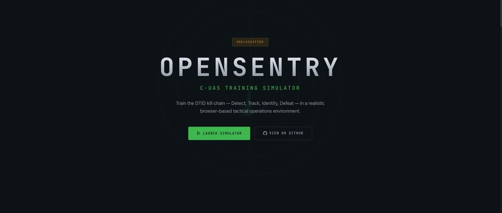

# OpenSentry



**Free, browser-based C-UAS training simulator.** Practice the full DTID kill chain (Detect → Track → Identify → Defeat) in a realistic tactical operations center — no install, no account, no clearance required.

**Target user:** "The E-5 who gets handed the C-UAS binder and told to figure it out."

## 🚀 [Launch Simulator →](https://jdelvo06-debug.github.io/opensentry/)

> No install. No account. Just open the link and train.

> 🗺️ **Train at your actual base.** Drop a pin anywhere on Earth — real satellite imagery loads automatically. Set your perimeter, place your sensors, and run scenarios on terrain your operators actually defend. Not a demo airfield. Your location.

**Version:** v1.9.0 | **Status:** Active development

---

## What Is This?

OpenSentry puts you in the seat of a C-UAS operator managing a real-time airspace picture. Contacts appear on your tactical map, you track them, identify them through the EO/IR camera, and decide how to respond — all under time pressure and within realistic Rules of Engagement.

Scoring is based on operational doctrine: detection speed, identification accuracy, countermeasure selection, ROE compliance, and proportionality. Not a game — a training tool.

---

## Scenarios

| Scenario | Duration | Description | Difficulty |
|----------|----------|-------------|------------|
| **Tutorial** | 5 min | Guided walkthrough — single contact, no waves | Beginner |
| **Lone Wolf** | 8 min | Single drone threat; build the kill chain start to finish | Easy |
| **Recon Probe** | 12 min | Multi-contact with trigger discipline — not everything gets engaged | Medium |
| **Swarm Attack** | 15 min | High-volume multi-wave with Shahed-style autonomous threat | Hard |
| **THERMOPYLAE** | 20 min+ | Unscripted free-play — 3 escalating phases, endless mode, all threat types | Variable |
| **Free Play** | Unlimited | Open sandbox — mixed threats, one of each system, no timer | Casual |

---

## Equipment

All systems are fictional but specification-accurate — no real program of record designators.

### Sensors
| System | Type | Range | Notes |
|--------|------|-------|-------|
| L-Band Multi-Mission Radar | Surveillance | 10 km | 360°, all-weather, primary detection |
| Ku-Band Fire Control Radar | Fire control | 16 km | Guides JACKAL interceptors |
| EO/IR Camera | Pan/tilt/zoom | 8 km | Thermal + daylight, slew-to-cue, visual ID |

### Effectors
| System | Type | Range | Notes |
|--------|------|-------|-------|
| RF/PNT Jammer | Electronic warfare | 5 km | Disrupts RF command links + GPS/PNT nav; rechargeable |
| JACKAL Pallet | Kinetic interceptor | 10 km | 4 interceptors; 10–15s spinup; requires Ku-Band FCS |
| Shenobi | RF detect + Protocol Manipulation | 8km/6km | Downlink acquisition → uplink defeat (HOLD / LAND NOW / DEAFEN) |

### Threats
| Threat | RF Jam Resistance | Notes |
|--------|------------------|-------|
| Commercial Quad | 0% | Fully jammable; Shenobi-vulnerable |
| Micro UAS | 10% | Small RCS; hard to visually ID |
| Fixed-Wing UAS | 40% | Faster; partially jam-resistant |
| Improvised UAS | 50% | Unknown electronics; Shenobi library miss likely |
| Shahed-style | 100% (RF-immune) | INS-primary; **RF jamming has no effect**; kinetic defeat required |
| Bird / Balloon | — | Ambient traffic; cannot be engaged (ROE) |
| Passenger / Military Jet | — | ATC-clearable; may appear as UNKNOWN contacts |

---

## ATC Coordination Mechanic

Some contacts spawn as **UNKNOWN** (yellow) — unidentified aircraft that may or may not be in the ATC system. Before engaging, operators can:

1. Select the UNKNOWN track → click **CALL ATC** in the Engagement Panel or radial WOD
2. Wait 6–8 seconds for ATC response (floating comms window, bottom-right of map)
3. ATC responds: *"confirmed authorized aircraft"* or *"not in our system"*
4. If authorized → tag as **FRIENDLY** and stand down
5. If not in system → proceed with identification and engagement

**Engaging an UNKNOWN track before ATC clearance triggers a Blue-on-Blue penalty.**

UAS and drone contacts are never ATC-authorized — only manned aircraft can receive clearance.

---

## Scoring

| Category | Weight | Criteria |
|----------|--------|----------|
| Detection Awareness | 20% | Time from contact spawn to first operator click |
| Confirmation Quality | — | Rewards deliberate 3–15s confirmation; flags impulsive <2s |
| Tracking | 15% | Time and accuracy of contact tracking |
| Identification | 20% | Correct classification and affiliation |
| Defeat Method | 25% | Optimal vs. acceptable vs. poor countermeasure selection |
| ROE Compliance | 20% | Did you follow the rules of engagement? |
| Completion Multiplier | — | Penalty for ending mission early (<90% duration) |

**Grades:** S → A → B → C → F (base compromised)

---

## Features

- **📍 Custom base location** — Before any scenario, drop a pin anywhere on Earth. Real satellite imagery loads for that location. Place your sensors, set your perimeter, and train on the terrain you actually defend. Your base. Your airspace.
- **Real-world satellite maps** via Leaflet.js — OpenStreetMap + CartoDB imagery, global coverage
- **Pre-mission ROE briefing** — review Rules of Engagement before each scenario
- **ATC coordination mechanic** — UNKNOWN contacts require IFF clearance before engagement
- **Neutral track labels** — contacts spawn as TRN-### until you identify them
- **Track type display** — classification and affiliation shown post-identification
- **Camera orientation** — aircraft rotate in the camera view based on viewing angle
- **Spawn randomization** — threat positions, headings, and speeds vary each run
- **Radial action wheel** — WOD-style engagement controls (right-click any track)
- **Event log** — full engagement history, color-coded by severity
- **Post-scenario debrief** — performance metrics, ROE violation summary, letter grade
- **Training library** — 5-module slide-style study curriculum, accessible from main menu
- **THERMOPYLAE free-play scenario** — Escalating chaos mode with endless toggle and manual end
- **Free Play sandbox** — casual mixed-threat mode with one of each system and no timer; end when done
- **Interactive tutorial** — two-phase guided experience: UI tour overlay with spotlights, then hands-on DTID practice with gated progression, step tracker, and feedback
- **Base Defense Architect v2** — 4-step unified flow (Base → Equip → Place → Export) with terrain-aware viewshed, per-system coverage toggle, draggable boundary, altitude controls down to 2m AGL, Dark/Satellite/Topo map layers, and geo search. Design your defense, see coverage gaps, then launch directly into a mission.

---

## Architecture

OpenSentry runs entirely in the browser — no server required.

```
src/game/           ← TypeScript game engine (10Hz, runs in browser)
  state.ts          ← All types + GameState factory
  loop.ts           ← Game tick, wave spawning, debrief builder
  drone.ts          ← 4 movement behaviors
  detection.ts      ← Multi-sensor detection (FOV, LOS, noise)
  jamming.ts        ← RF + PNT jamming logic
  shenobi.ts          ← Shenobi protocol manipulation state machine
  jackal.ts         ← JACKAL interceptor lifecycle
  waves.ts          ← Wave + ambient traffic spawning
  scoring.ts        ← Full DTID scoring engine
  actions.ts        ← 16 player action handlers

frontend/src/
  App.tsx           ← State machine, phase transitions, doctrine loadouts
  hooks/
    useGameEngine.ts ← 10Hz game loop (browser-native, no WebSocket needed)
  components/       ← All UI components

frontend/public/data/
  scenarios/        ← JSON scenario definitions
  bases/            ← JSON base templates
  equipment/        ← Equipment catalog

backend/            ← Python/FastAPI reference implementation (kept, not required)
```

**Deploy:** `git push origin main` → GitHub Actions builds and deploys to GitHub Pages automatically.

---

## Local Development

```bash
cd frontend && npm run dev
# → http://localhost:5173
```

No Python backend required. The game engine runs entirely client-side via `useGameEngine.ts`.

---

## Roadmap

### Completed (v1.5.0)
- [x] **#10** — ATC coordination mechanic for UNKNOWN tracks
- [x] **#23** — Track type and affiliation display post-identification
- [x] **#24** — Remove ghost tracks from map after defeat
- [x] **#25** — Tutorial single-contact mode (waves disabled)
- [x] **#29** — Camera orientation by viewing angle + civilian aircraft color
- [x] **#33** — Post-scenario debrief scorecard ✓
- [x] **#31** — C-UAS training library ✓
- [x] **#35** — THERMOPYLAE free-play scenario ✓

### Completed (v1.6.0)
- [x] **#43** — EO/IR silhouette visual overhaul (all threat types) ✓
- [x] **#47** — Jamming realism: ATTI mode ✓
- [x] **#48** — Hardened FPV FHSS mechanic ✓

### Completed (v1.7.0)
- [x] **#51/52** — MIL-STD-2525 affiliation mechanic (HOSTILE/NEUTRAL/FRIEND/UNKNOWN declaration required before defeat) ✓
- [x] Polygon breach detection — precise perimeter breach via `pointInPolygon` ✓
- [x] Shahed-class RF jam immunity — INS-guided threats require kinetic defeat ✓
- [x] UI compression — TrackDetailPanel 2-column grid, EngagementPanel full-height ✓

### Code Review (v1.7.1)
- [x] Bug fixes: stale closures, negative detection probability, type safety gaps, parallel data loading
- [x] Test suite: 28 vitest unit tests covering game engine core (detection, movement, jamming, scoring)
- [x] Slop cleanup: CSS hover classes, standardized trail management, proper type guards
- [x] Type tightening: union types for CM state, jam behavior, intercept phase
- [x] Documentation: naming consistency, version alignment, architecture updates

### Completed (v1.8.0)
- [x] **#54/55** — Base Defense Architect: altitude-aware sensor placement, viewshed, terrain LOS
- [x] **#56/57** — Free Play scenario: casual mixed-threat sandbox mode
- [x] **#58/59** — Interactive tutorial overhaul: UI tour + guided DTID practice, step tracker, feedback

### Completed (v1.9.0)
- [x] **PR #3** — BDA v2 stepper refactor: 2830-line monolith → 120-line shell + 13 focused components
- [x] Unified 4-step flow: Base Selection → Equipment Selection → Placement & Viewshed → Export
- [x] Per-system coverage toggle, enriched equipment cards, draggable boundary, map tile layers
- [x] LOS corrections: Shenobi and RF Jammer now require line-of-sight
- [x] Geo search on placement map, export preserves custom location coordinates

### Backlog
- [ ] Fix JACKAL trajectory + action wheel size (Issue #1)
- [ ] Save/load BDA designs (share with unit, iterate on layouts)
- [ ] After-action replay (timeline scrub)
- [ ] Multi-operator / shared mission
- [ ] React.lazy() code splitting for bundle size reduction
- [ ] Accessibility pass (ARIA labels, keyboard navigation)

---

## Feedback

Found a bug or have a training realism suggestion? Use the **feedback button** on the live site. Submissions go directly to the development queue.

---

## License

MIT — free to use, modify, and distribute for training purposes.

---

*OpenSentry was previously named SKYSHIELD. The project has been migrated to a new repository under its current name.*
