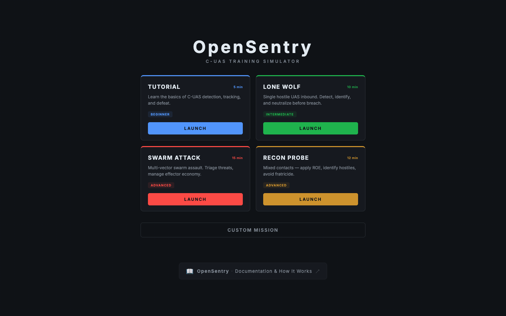
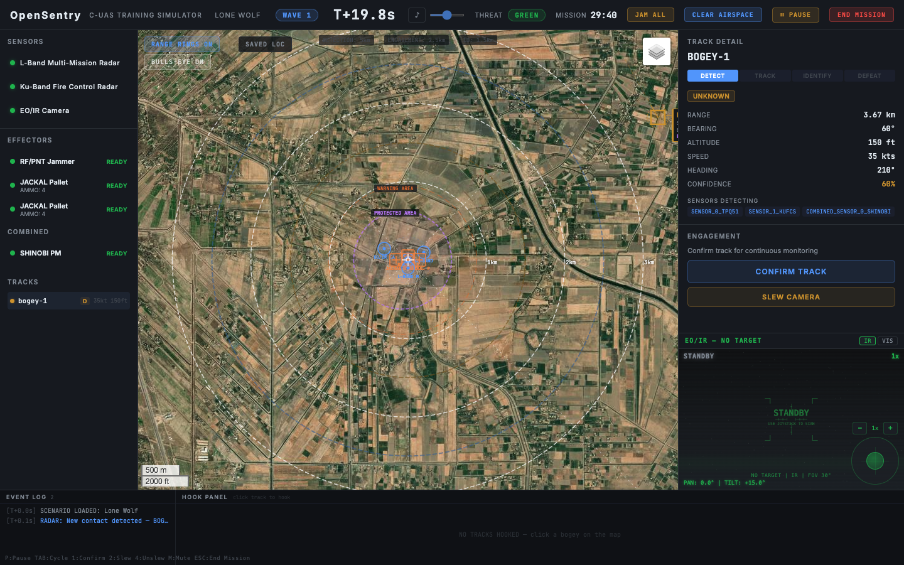

# OpenSentry

**Free, browser-based C-UAS training simulator.** Practice the full DTID kill chain (Detect → Track → Identify → Defeat) in a realistic tactical operations center environment — no clearance required.

**Target user:** "The E-5 who gets handed the C-UAS binder and told to figure it out."

## 🚀 [Launch Simulator →](https://alfred-intel-handler-source.github.io/skyshield/)

> No install. No account. No Python. Just open the link and train.

---

## Screenshots


*Mission select screen — four scenarios from Tutorial to Swarm Attack, with difficulty and duration at a glance.*


*Live mission view — satellite tactical map, multi-sensor track panel, engagement controls, and real-time ETA/threat level.*


*Track data card — range, bearing, altitude, speed, confidence, DTID phase, and RF status updated at 10Hz.*

---

## Features

### Core Gameplay — DTID Kill Chain
- **Detect** — L-Band surveillance radar and Ku-Band fire control radar pick up contacts at 10km
- **Track** — Confirm contacts, watch trail history, monitor coasting tracks
- **Identify** — Slew EO/IR camera, visually ID drone silhouette (quad, fixed-wing, Shahed, bird, balloon)
- **Defeat** — Kinetic (JACKAL interceptor), EW (RF/PNT Jammer), or RF protocol manipulation (SHINOBI)

---

### Equipment

All systems are fictional but specification-accurate — designed to reflect the capabilities and limitations of real-world C-UAS equipment without reproducing any specific program of record.

#### Sensors

| System | Type | Range | FOV | Notes |
|--------|------|-------|-----|-------|
| **L-Band Multi-Mission Radar** | Surveillance radar | 10 km | 360° | Lightweight rotating antenna; primary detection sensor for Group 1–3 UAS; all-weather; no LOS required |
| **Ku-Band Fire Control Radar** | Fire control radar | 10 km | 360° | Precision track data; guides JACKAL interceptors to target; requires line of sight; single track at a time |
| **EO/IR Camera** | Pan/tilt/zoom camera | 8 km | 360° pan | Electro-optical + infrared; thermal and daylight modes; 1x–40x zoom; used for visual ID; weather/LOS dependent |

#### Effectors

| System | Type | Range | Notes |
|--------|------|-------|-------|
| **RF/PNT Jammer** | Electronic warfare | 5 km | Disrupts RF command links and GPS/PNT navigation; effective against commercial UAS; passive area suppression once activated; rechargeable; can affect friendly GPS |
| **JACKAL Pallet** | Kinetic interceptor | 10 km | Tube-launched, Ku-Band radar-guided; proximity-fused warhead; 10–15s spinup before launch; 4 interceptors per pallet (single-use); requires Ku-Band Fire Control Radar for mid-course guidance |

#### Combined Sensor/Effector

| System | Type | Detect Range | Defeat Range | Notes |
|--------|------|-------------|--------------|-------|
| **SHINOBI** | RF detect + Protocol Manipulation | 8 km | 6 km | Passive omnidirectional antennas scan 2.4 GHz, 5.8 GHz, 430 MHz, and 900 MHz for drone control links; library-based (known protocols only); CM state progresses from 1/2 (downlink acquired) to 2/2 (uplink acquired, full defeat available); defeat modes: **HOLD** (freeze in place), **LAND NOW** (forced descent), **DEAFEN** (sever RF link); no collateral risk; ineffective vs. autonomous/non-RF targets |

---

### Threat Types

| Threat | RF Jam Resistance | PNT Jam Effect | Notes |
|--------|------------------|----------------|-------|
| **Commercial Quad** | 0% | High drift | GPS/RF dependent; fully jammable; SHINOBI-vulnerable |
| **Fixed-Wing UAS** | 40% | Light drift | Faster; harder to track; partially jam-resistant |
| **Micro UAS** | 10% | Moderate drift | Small radar cross-section; difficult to visually ID |
| **Improvised UAS** | 50% | Moderate drift | Unknown electronics; SHINOBI library miss likely |
| **Shahed-style** | 100% (RF-immune) | Minor drift | INS-primary with GPS correction; **RF jamming has no effect**; PNT jamming degrades terminal accuracy but does not defeat; kinetic defeat (JACKAL) required for kill |
| **Bird / Weather Balloon** | — | Immune | Ambient traffic; **cannot be engaged** (ROE) |
| **Passenger Aircraft / Military Jet** | — | Immune | Ambient traffic; ATC-clearable via CLEAR AIRSPACE |

**PNT Jamming vs. RF Jamming — Tactical Distinction:**
The RF/PNT Jammer applies two independent effect layers:
- **RF command link disruption** — defeats GPS/RF-dependent drones (behavioral effects: loss of control, RTH, forced landing, GPS spoof). Shahed is immune.
- **PNT/GPS navigation denial** — injects positional drift, degrading terminal accuracy on all drone types. Shahed receives minor drift (~3 mm/s/tick) for 15–25 seconds, displayed as **PNT DEGRADED** in the engagement panel. Does not defeat the Shahed — it will still reach the target area, but with reduced accuracy.

**Tactical decision:** Burning the jammer on a Shahed won't kill it, but PNT degradation buys time to spin up JACKAL. Use jammer for PNT suppression, JACKAL for the kill.

---

### UI/UX

- **Real-world satellite maps** via Leaflet.js + OpenStreetMap (any location on Earth)
- **FAAD C2 / Medusa-style interface** — radial action wheel (WOD), track data blocks, range rings
- **EO/IR Camera panel** — thermal/daylight modes, realistic drone silhouettes, heat shimmer effect
- **Track list** — live contact feed in left sidebar (all contacts including ambient traffic)
- **Event log** — color-coded by severity, full engagement history
- **Debrief screen** — per-category scoring, full mission timeline

### Operational Features

- **JAM ALL** — activates all RF/PNT jammers simultaneously
- **CLEAR AIRSPACE** — removes ATC-clearable aircraft (jets/commercial); birds and balloons unaffected
- **Hold Fire** — ROE lockout on individual tracks
- **Continuous ops** — wave-based; mission runs until player ends it
- **JACKAL spinup** — realistic 10–15s warmup sequence before intercept launch
- **SHINOBI 1/2 → 2/2 progression** — downlink detection → uplink acquisition → full defeat options
- **Passive area jamming** — activated jammer auto-affects all susceptible targets in range each tick

---

## Scenarios

| Scenario | Description | Difficulty |
|----------|-------------|------------|
| **Tutorial** | Guided walkthrough of the full DTID kill chain | Beginner |
| **Lone Wolf** | Single drone threat; practice the basic kill chain | Easy |
| **Swarm Attack** | 5 drones including a Shahed-style autonomous threat + active jammer | Hard |
| **Recon Probe** | 3 drones with ROE trigger discipline — not everything should be engaged | Medium |

---

## Quick Start

### Prerequisites
- Python 3.10+
- Node.js 18+

### Install
```bash
make install
```

### Run
```bash
# Terminal 1 — backend
cd backend && python3 -m uvicorn app.main:app --reload --port 8000

# Terminal 2 — frontend
cd frontend && npm run dev
```

Open **http://localhost:5173** and hit **QUICK START**.

---

## Architecture

```
backend/
  app/
    main.py          — FastAPI app, WebSocket game loop (10Hz)
    models.py        — DroneState, GameState, enums
    actions.py       — Player action handlers
    config.py        — Server config, shared constants (KTS_TO_KMS)
    jamming.py       — EW jamming logic; RF resistance + PNT vulnerability tables; drift tick
    jackal.py        — JACKAL interceptor lifecycle (spinup/launch/midcourse/terminal)
    shinobi.py       — SHINOBI protocol manipulation state machine
    detection.py     — Sensor detection logic
    helpers.py       — Placement builders, range checks, threat level
    scenario.py      — Scenario loading
    waves.py         — Wave spawning + ambient traffic
    drone.py         — Drone movement/behavior
    scoring.py       — DTID scoring engine (5 categories, S–F grades)
    game_state.py    — Per-connection game state management
  equipment/
    catalog.json     — Equipment definitions (L-Band radar, Ku-Band FCS, EO/IR, RF Jammer, JACKAL, SHINOBI)
  scenarios/
    lone_wolf.json   — Single drone
    swarm_attack.json — 5 drones + Shahed-style
    recon_probe.json — 3 drones with trigger discipline
    tutorial.json    — Guided walkthrough
  bases/
    small_fob.json / medium_airbase.json / large_installation.json

frontend/src/
  App.tsx            — State machine, WebSocket, phase transitions, doctrine loadouts
  hooks/
    useWebSocket.ts  — WebSocket connection + reconnection logic
  components/
    TacticalMap.tsx  — Leaflet map, track icons, range rings, WOD
    CameraPanel.tsx  — EO/IR canvas renderer (thermal + daylight, 6 silhouettes)
    RadialActionWheel.tsx — Right-click action wheel + SHINOBI CM submenu
    EngagementPanel.tsx — DTID phase controls + SHINOBI CM state display
    EventLog.tsx     — Event log + FAAD hook panel (multi-track baseball cards)
    HeaderBar.tsx    — Mission status, JAM ALL / CEASE JAMMING, CLEAR AIRSPACE
    TrackList.tsx    — Live contact list (left sidebar)
    SensorPanel.tsx  — Sensor status (filters combined systems)
    EffectorPanel.tsx — Effector status + COMBINED section
    LoadoutScreen.tsx — Equipment selection for Custom Mission
    PlacementScreen.tsx — Drag-drop placement on real-world map
    DebriefScreen.tsx — Post-mission scoring
```

---

## Roadmap

### Phase 2 (Next)
- [ ] Terrain LOS checks for sensors/effectors
- [ ] After-action replay (timeline scrub on debrief)
- [ ] Score system improvements (ambient aircraft handling, multi-wave scoring)
- [ ] Coverage gap visualization (LOS shadows, uncovered sectors)

### Phase 3
- [ ] Multi-operator / shared mission (two operators on same WebSocket)
- [ ] Mobile-responsive layout (tablet field demos)
- [ ] Docker production deployment
- [ ] Port to all-client-side JS (zero-server, deployable anywhere)

---

## License
MIT — free to use, modify, and distribute for training purposes.
